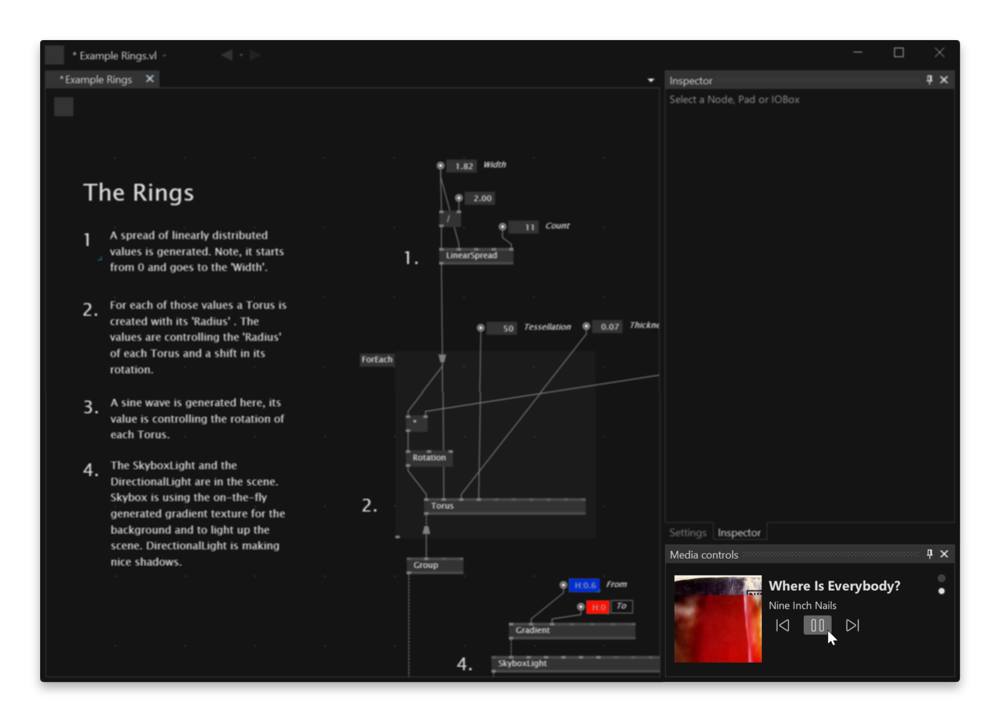

# VL.MediaControls.HDE

 

Control your Windows media sessions without leavvvving your favorite editor

	

## Features

Allows to control the playback of all media sessions registered on Windows from the vvvv editor. You can control streaming apps like Spotify, YouTube videos in your browser or any browser-based music streaming service.

## Installation

Go to the Quad Menu, select Settings, and click the _Extensions_ tab. There, search for _VL.MediaControls.HDE_ and click _Install_. The extension will now be available in the Quad Menu under _Windows_.